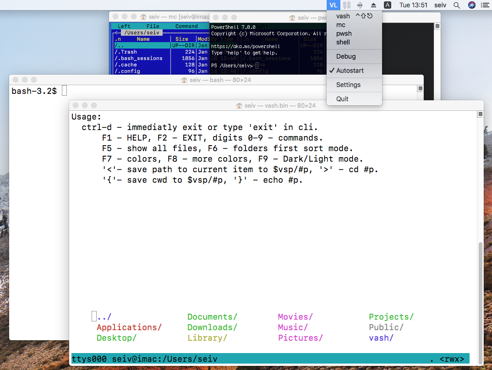
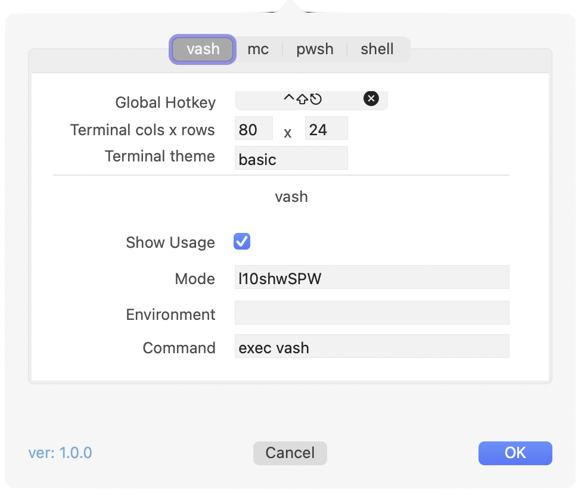
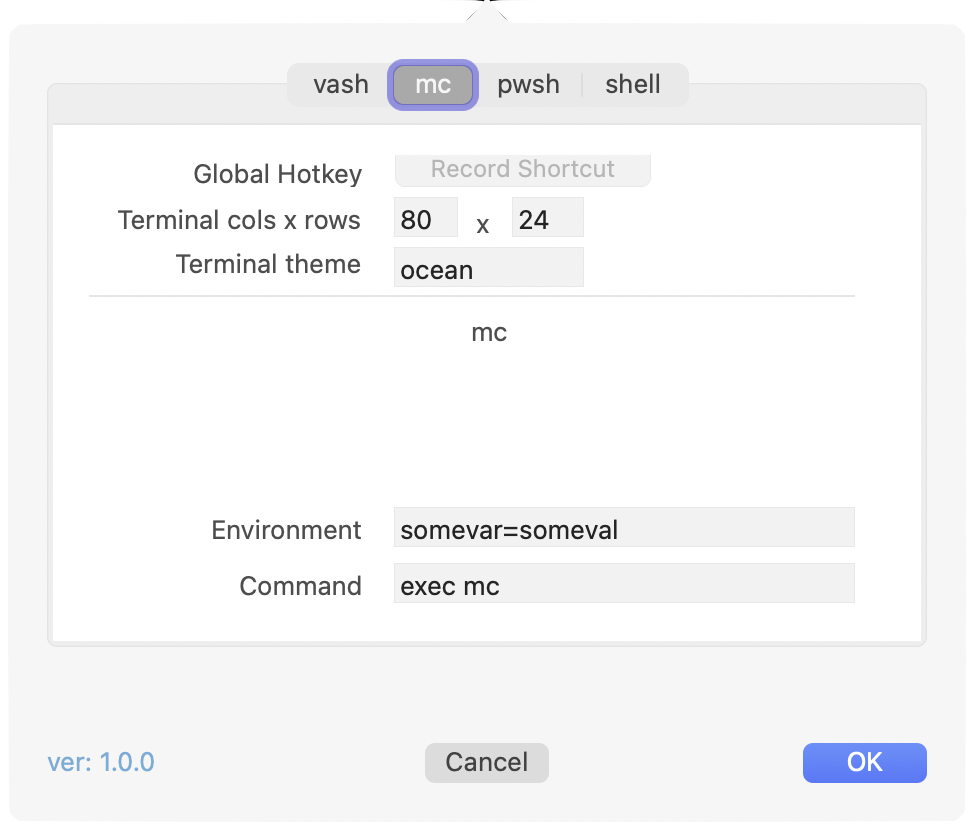
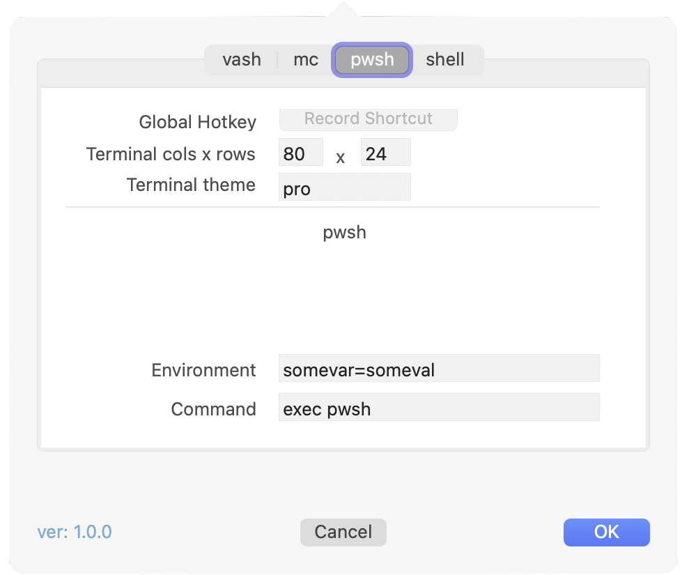
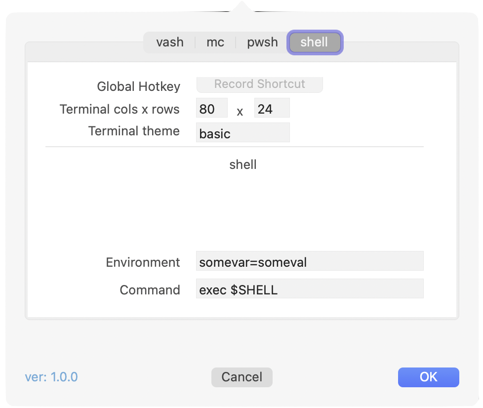

VashLauncher
============

- MacOS StatusBar app for launching CLI shells. 
- Global hotkeys.
- MacOS: 10.13+
- Arch: x86_64/aarm64

Vash
====

- [Short Guide](Vash.md)
  
Settings
========

- vash  
  
- mc  
  
- pwsh  
  
- shell  
  
